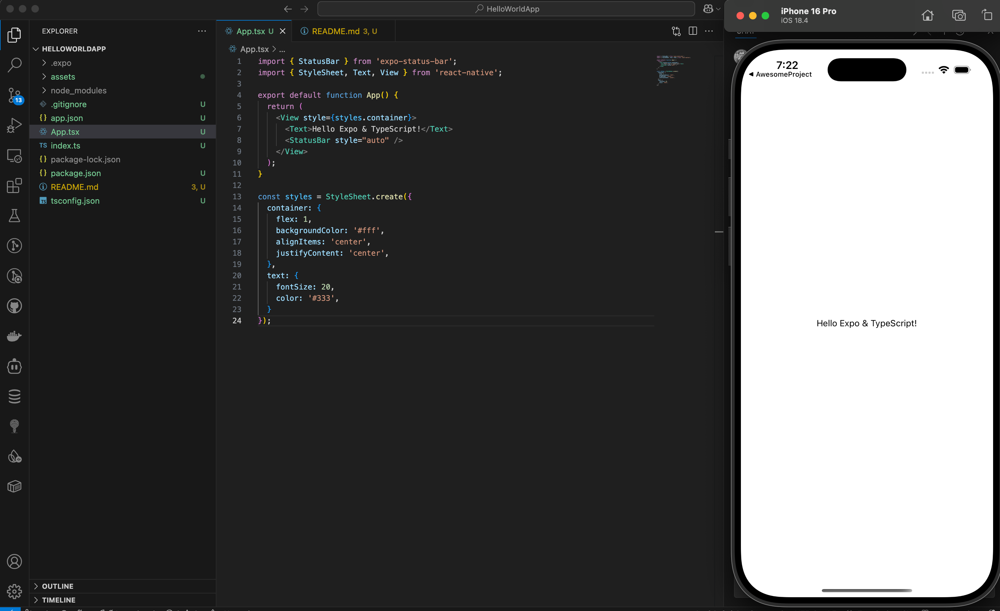

# HelloWorldApp

A simple React Native application created with Expo.



## Description

HelloWorldApp is a starter React Native application that displays a welcome message. It was created using Expo, which is a framework and platform for building React Native applications.

## Installation

1. Clone the repository
2. Install dependencies:

```bash
npm install
```

## Running the App

To start the development server:

```bash
npx expo start
```

This will open the Expo developer tools in your browser. From there, you can:
- Run on an iOS simulator
- Run on an Android emulator
- Scan the QR code with the Expo Go app on your physical device

## Project Structure

```
HelloWorldApp/
├── App.tsx            # Main application component
├── app.json           # Expo configuration
├── index.ts           # Entry point for the app
├── package.json       # Dependencies and scripts
├── tsconfig.json      # TypeScript configuration
└── assets/            # Contains images and icons
```

## Dependencies

- React Native
- Expo

## License

This project is open source and available under the MIT license.