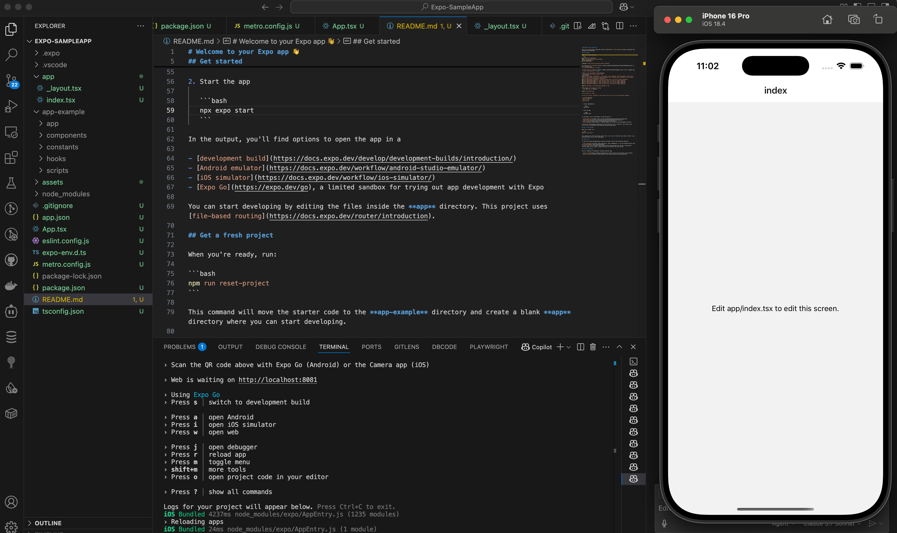

# Welcome to your Expo app 👋

This is an [Expo](https://expo.dev) project created with [`create-expo-app`](https://www.npmjs.com/package/create-expo-app).

## Get started

0. Create a blank Expo app

```bash
npx create-expo-app@latest
Need to install the following packages:
create-expo-app@3.4.2
Ok to proceed? (y)

Creating an Expo project using the default template.

To choose from all available templates (https://github.com/expo/expo/tree/main/templates) pass in the --template arg:
  $ npx create-expo-app --template

To choose from all available examples (https://github.com/expo/examples) pass in the --example arg:
  $ npx create-expo-app --example

✔ What is your app named? … Expo-SampleApp
✔ Downloaded and extracted project files.
> npm install
npm warn deprecated inflight@1.0.6: This module is not supported, and leaks memory. Do not use it. Check out lru-cache if you want a good and tested way to coalesce async requests by a key value, which is much more comprehensive and powerful.
npm warn deprecated rimraf@3.0.2: Rimraf versions prior to v4 are no longer supported
npm warn deprecated glob@7.2.3: Glob versions prior to v9 are no longer supported
npm warn deprecated glob@7.2.3: Glob versions prior to v9 are no longer supported
npm warn deprecated glob@7.2.3: Glob versions prior to v9 are no longer supported
npm warn deprecated glob@7.2.3: Glob versions prior to v9 are no longer supported

added 971 packages, and audited 972 packages in 38s

178 packages are looking for funding
  run `npm fund` for details

found 0 vulnerabilities

✅ Your project is ready!

To run your project, navigate to the directory and run one of the following npm commands.

- cd Expo-SampleApp
- npm run android
- npm run ios
- npm run web
```

1. Install dependencies

   ```bash
   npm install
   ```

2. Start the app

   ```bash
   npx expo start
   ```

In the output, you'll find options to open the app in a

- [development build](https://docs.expo.dev/develop/development-builds/introduction/)
- [Android emulator](https://docs.expo.dev/workflow/android-studio-emulator/)
- [iOS simulator](https://docs.expo.dev/workflow/ios-simulator/)
- [Expo Go](https://expo.dev/go), a limited sandbox for trying out app development with Expo

You can start developing by editing the files inside the **app** directory. This project uses [file-based routing](https://docs.expo.dev/router/introduction).

## Get a fresh project

When you're ready, run:

```bash
npm run reset-project
```

This command will move the starter code to the **app-example** directory and create a blank **app** directory where you can start developing.

## Screenshots



## Learn more

To learn more about developing your project with Expo, look at the following resources:

- [Expo documentation](https://docs.expo.dev/): Learn fundamentals, or go into advanced topics with our [guides](https://docs.expo.dev/guides).
- [Learn Expo tutorial](https://docs.expo.dev/tutorial/introduction/): Follow a step-by-step tutorial where you'll create a project that runs on Android, iOS, and the web.

## Join the community

Join our community of developers creating universal apps.

- [Expo on GitHub](https://github.com/expo/expo): View our open source platform and contribute.
- [Discord community](https://chat.expo.dev): Chat with Expo users and ask questions.
