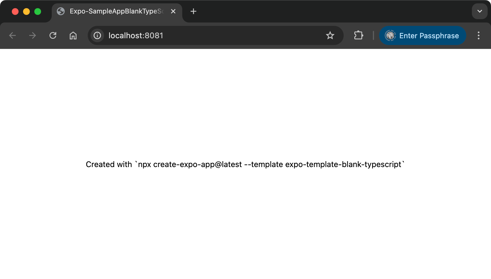
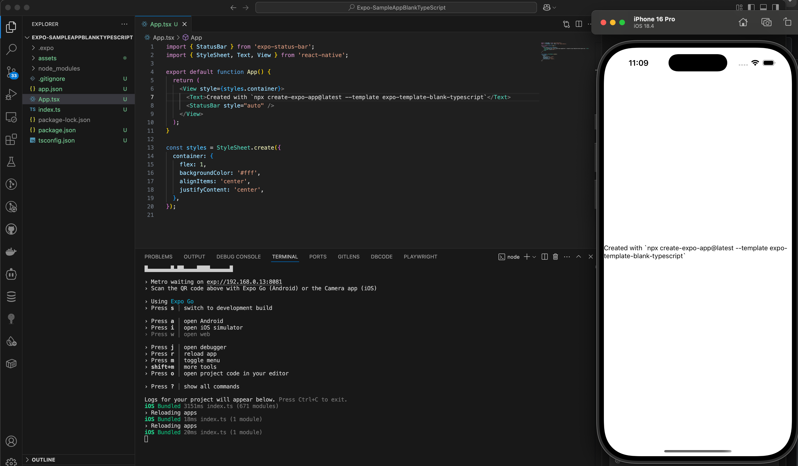

# Expo Sample App (Blank TypeScript)

This is a blank TypeScript project for React Native using Expo, created with the Expo CLI.

## Project Creation

This project was created on May 8th, 2025 using the following command:

```bash
npx create-expo-app@latest --template expo-template-blank-typescript
```

During setup, the app was named "Expo-SampleAppBlankTypeScript".

## Project Structure

The initial project structure includes:

```
├── app.json            # Expo configuration file
├── App.tsx             # Main application component
├── index.ts            # Entry point
├── package.json        # Dependencies and scripts
├── tsconfig.json       # TypeScript configuration
└── assets/             # Static assets
    ├── adaptive-icon.png
    ├── favicon.png
    ├── icon.png
    └── splash-icon.png
```

## Web Support Dependencies

The project has been configured with web support by installing the following packages:

```bash
npx expo install react-dom@19.0.0 react-native-web@^0.20.0 @expo/metro-runtime@~5.0.4
```

These packages are necessary for running your Expo application in a web browser.

## How to Run the Project

1. Make sure you have Node.js and npm installed on your machine.

2. Install dependencies (if not already installed):
   ```bash
   npm install
   ```

3. Start the development server:
   ```bash
   npm start
   # or
   npx expo start
   ```

4. Run on specific platforms:
   ```bash
   # For iOS
   npm run ios
   
   # For Android
   npm run android
   
   # For Web
   npm run web
   # or
   npx expo start --web
   ```

## Next Steps: Adding Features

Here are some suggestions to enhance your app:

1. **Setup Navigation**:
   - Install React Navigation: `npm install @react-navigation/native @react-navigation/native-stack`
   - Set up basic screens and navigation flow

2. **Add State Management**:
   - For simple state: React Context API
   - For complex state: Redux or Zustand

3. **Styling and UI Components**:
   - Add a UI library like React Native Paper or Native Base
   - Set up a theme with consistent colors, typography, and spacing

4. **Data Fetching**:
   - Implement API calls using fetch, axios, or React Query
   - Add loading states and error handling

5. **Local Storage**:
   - Use AsyncStorage or Expo SecureStore for persistent data

6. **Authentication**:
   - Implement user login/signup flows
   - Add social authentication options

7. **Testing**:
   - Set up Jest and React Native Testing Library
   - Write unit and integration tests

8. **Deployment**:
   - Configure app.json for production
   - Build using Expo EAS: `npx eas build`
   - Submit to app stores

## Screenshots




## Documentation Resources

- [Expo Documentation](https://docs.expo.dev/)
- [React Native Documentation](https://reactnative.dev/docs/getting-started)
- [TypeScript Documentation](https://www.typescriptlang.org/docs/)