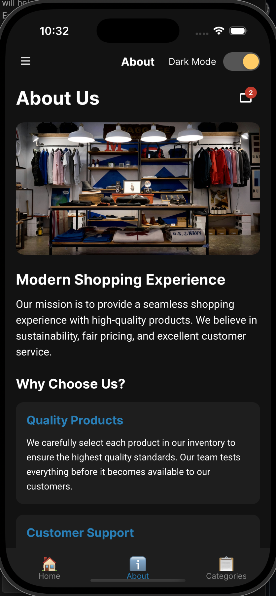
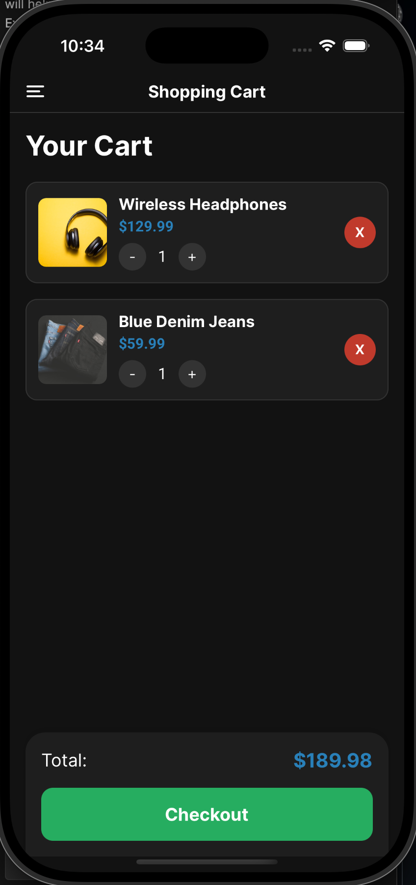
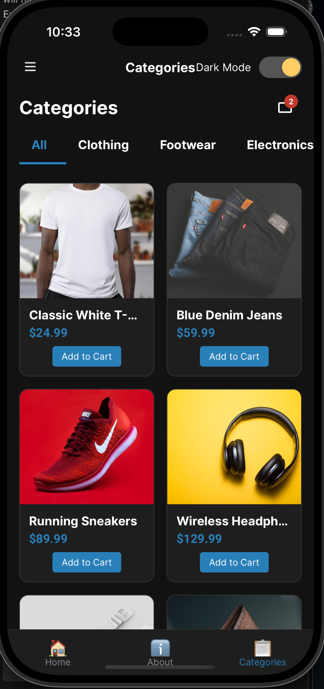
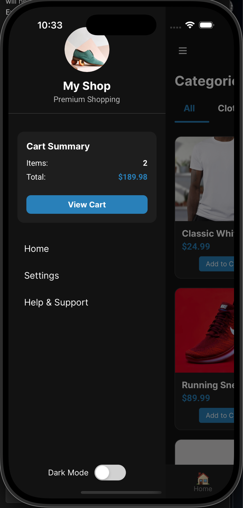
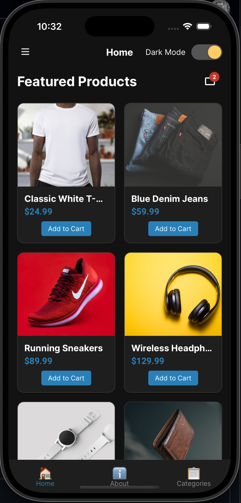
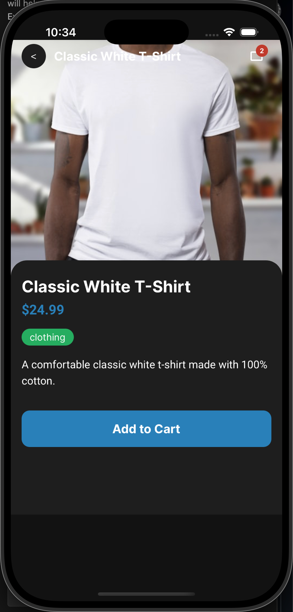
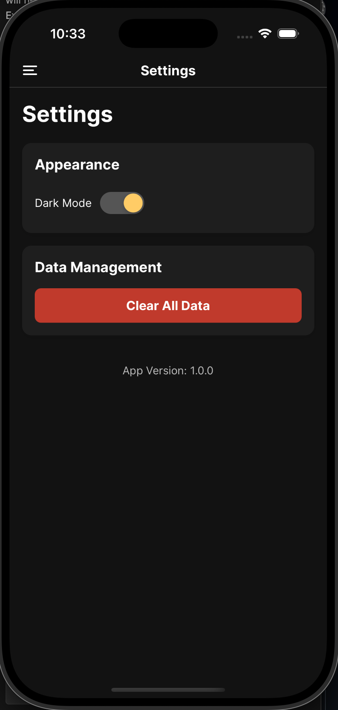
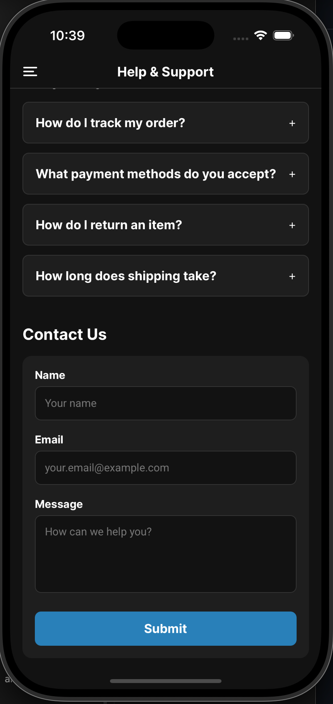
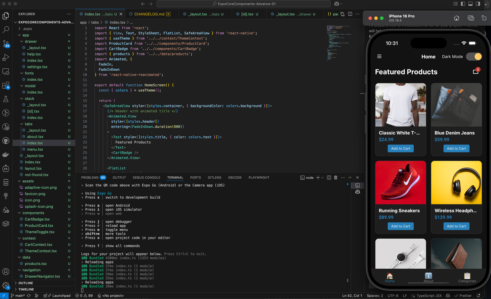

# Expo Core Components Advanced Application

This React Native application demonstrates advanced implementation of navigation patterns and core components using Expo Router. The project showcases different navigation types, custom styling, and best practices for mobile app development.

## Screenshots

<div style="display: flex; flex-wrap: wrap; gap: 10px; justify-content: center;">
   
   
   
   
</div>
<div style="display: flex; flex-wrap: wrap; gap: 10px; justify-content: center; margin-top: 10px;">
   
   
   
   
</div>

 

## Navigation Patterns Implemented

### Tab Navigation
- Bottom tab navigator with Home, Menu, and About tabs
- Customized icons and styling for the tab bar

### Stack Navigation
- Product listing and details with push-pop navigation
- Dynamic routes for individual product details using [id].tsx

### Drawer Navigation
- Side menu with Home, Settings, and Help screens
- Custom drawer icons and styling

### Modal Navigation
- Full-screen modal that slides up from the bottom
- Demonstrates presentation mode differences

## Key Features

### File-based Routing
- Implemented Expo Router's directory-based routing system
- Created proper nested navigation patterns

### Not Found Route
- Custom 404 page with comprehensive styling
- Proper error handling for non-existent routes

### Custom Fonts
- Integrated Google Fonts (Inter and Roboto)
- Demonstrated different font weights and styles
- Created a dedicated fonts example page

### SafeArea Implementation
- Used SafeAreaView throughout the app to handle device notches and system UI

### Splash Screen
- Configured splash screen with custom background color
- Set up proper splash screen display during font loading

### Sample Products
- Integrated iPhone comparison data
- Created detailed product displays using this data

### Theme Switching (Dark/Light Mode)
- Implemented a ThemeContext with persistent preferences using AsyncStorage
- Created a smooth animated toggle component
- Applied theming throughout the entire app with proper color schemes

### Shopping Cart State Management
- Built a comprehensive CartContext for managing products
- Implemented add/remove/update quantity functionality
- Added persistent storage of cart items using AsyncStorage

### Animations for Smoother Transitions
- Added entrance animations for all screens and components
- Implemented interactive feedback animations (like press effects)
- Created smooth transitions between screens and states
- Used Reanimated for performant animations

### Data Persistence with AsyncStorage
- Saved theme preferences
- Persisted shopping cart items
- Added ability to clear all data from settings

### Product Images & UI Enhancements
- Used proper high-quality product images
- Implemented animated product cards
- Created a comprehensive product detail screen
- Built a category filtering system with animated indicators

## React Native & Expo Components Used

This project showcases various React Native and Expo components that are essential for modern mobile app development:

### Core Components
- **View** - Basic building block container for UI layout
- **Text** - Text display with custom styling and fonts
- **Image** - Image display with various resize modes
- **ScrollView** - Scrollable container for content
- **FlatList** - Efficient list rendering for product lists
- **Pressable** - Modern touchable component with press state
- **Modal** - Full-screen modal overlay
- **ActivityIndicator** - Loading spinner for async operations
- **SafeAreaView** - Container that respects device notches and system UI

### Navigation Components
- **Tabs** - Bottom tab navigation
- **Stack** - Push/pop navigation for screens
- **Drawer** - Side menu navigation
- **Link** - Expo Router link component for navigation

### UI Components
- **StatusBar** - Control for device status bar
- **Animated.View** - Container with animation capabilities
- **TouchableOpacity** - Touch feedback component
- **Switch** - Toggle component for theme switching

### Layout & Organization
- **Fragment** - Group components without extra DOM nodes
- **StyleSheet** - Structured styling system
- **Platform-specific code** - Conditional rendering for iOS/Android

## NPM Packages

| Package | Version | Description |
| ------- | ------- | ----------- |
| expo | ~53.0.8 | Core Expo SDK for React Native development |
| expo-router | ^3.5.24 | File-based routing for Expo apps |
| react | 19.0.0 | Core React library |
| react-native | 0.79.2 | Framework for building native apps using React |
| @expo-google-fonts/inter | ^0.3.0 | Inter font family for Expo projects |
| @expo-google-fonts/roboto | ^0.3.0 | Roboto font family for Expo projects |
| @react-native-async-storage/async-storage | ^2.1.2 | Data storage system for persistent app data |
| @react-navigation/bottom-tabs | ^6.6.1 | Tab navigation component |
| @react-navigation/drawer | ^6.7.2 | Drawer navigation component |
| @react-navigation/stack | ^6.4.1 | Stack navigation component |
| expo-constants | ^17.1.6 | Access app constants and configurations |
| expo-font | ^13.3.1 | Font loading and management |
| expo-linking | ^7.1.4 | Universal linking utilities |
| expo-splash-screen | ^0.30.8 | Splash screen management |
| expo-status-bar | ~2.2.3 | Status bar component for Expo apps |
| react-native-gesture-handler | ^2.25.0 | Native-driven gesture system for handling touches |
| react-native-reanimated | ^3.17.5 | Performance-optimized animation library |
| react-native-safe-area-context | 5.4.0 | Utilities for handling safe area insets |
| react-native-screens | ~4.10.0 | Native navigation primitives |
| react-native-vector-icons | ^10.2.0 | Customizable icons for React Native |

## Application Structure

The application follows a clean, organized structure:

```
app/ - Main directory for all screens and navigation
├── tabs/ - Bottom tab navigation screens
├── stack/ - Stack navigation screens
├── drawer/ - Drawer navigation screens
├── modal/ - Modal screen examples
├── fonts/ - Font demonstration screens
├── not-found.tsx - Custom 404 page
├── _layout.tsx - Root layout configuration
└── layout.tsx - General layout wrapper
```

Refer to the `[FILE-STRUCTURE.md](FILE-STRUCTURE.md)` for a detailed breakdown of each folder and its purpose.


## Getting Started

### Prerequisites
- Node.js (v14 or newer)
- Expo CLI (`npm install -g expo-cli`)
- iOS Simulator or Android Emulator (or physical device with Expo Go app)

### Installation

1. Clone this repository
2. Install dependencies:
   ```
   npm install
   ```
3. Start the development server:
   ```
   npx expo start
   ```

## Technologies Used

- React Native
- Expo Router
- Expo Vector Icons
- React Native Safe Area Context
- Google Fonts
- React Native Reanimated
- AsyncStorage

## Next Steps

The application is fully functional with all the requested features implemented. Potential enhancements include:

- Adding user authentication
- Implementing push notifications
- Adding order history functionality
- Creating a search bar with filter options
- Adding offline support for shopping when not connected