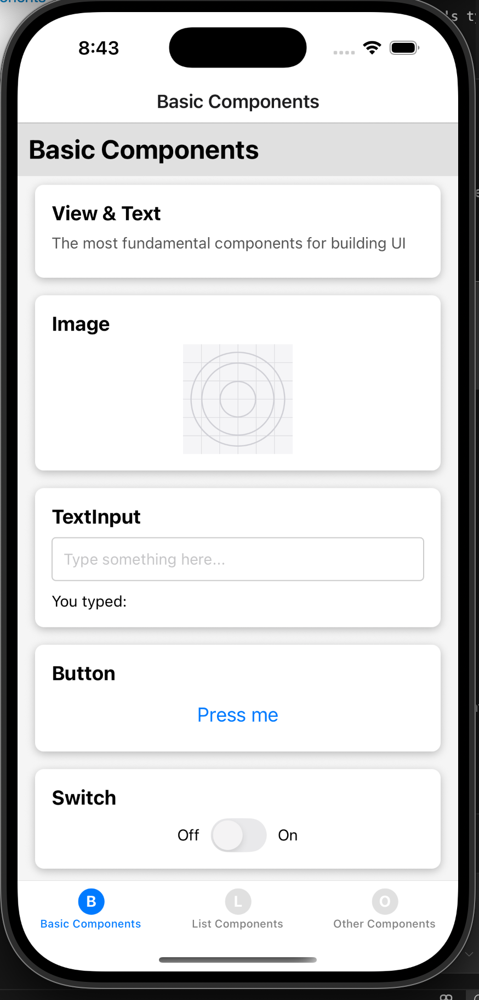
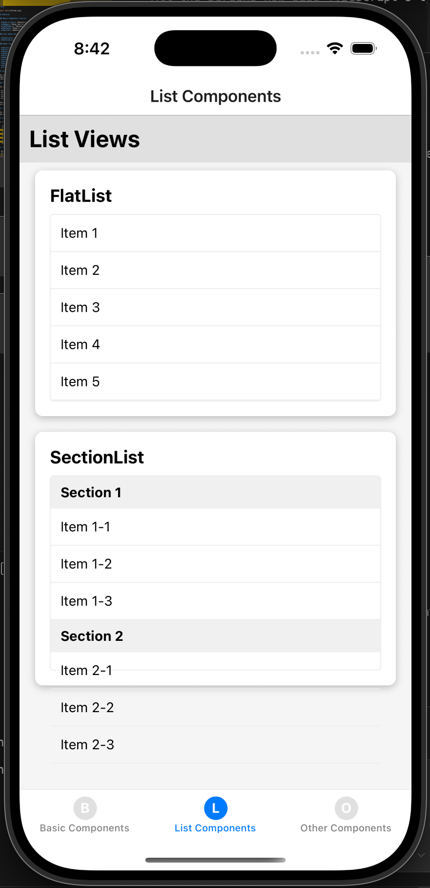
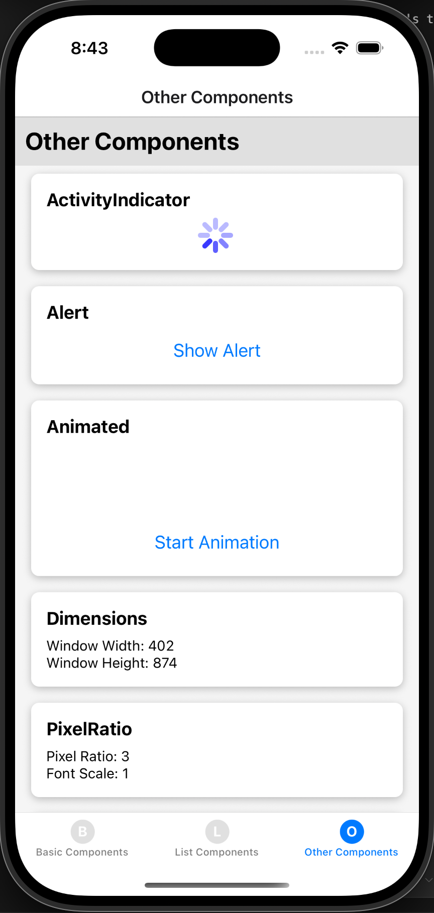
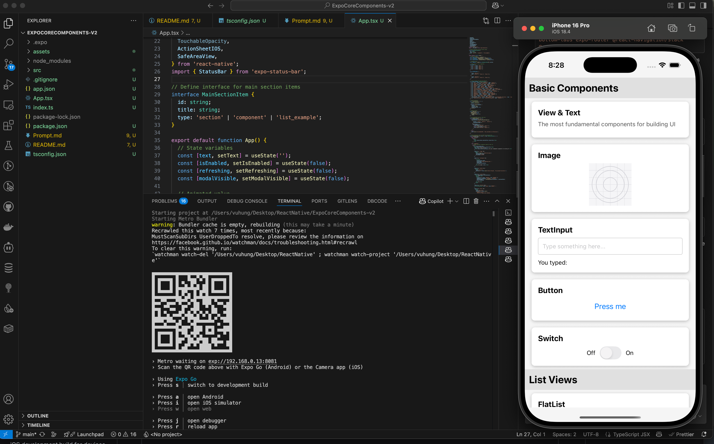

# Expo Core Components Showcase

This application demonstrates the usage of various Expo and React Native core components. It serves as a comprehensive reference and example for developers learning to work with React Native.

# Screenshots

<div align="center">
    
    
    
</div>



## Features

### Basic Components Section

- **View & Text**: Demonstrates basic layout and text display capabilities
- **Image**: Shows how to display an image using the local icon asset
- **TextInput**: Implements a text input field with real-time value display
- **Button**: Shows a clickable button that triggers an Alert
- **Switch**: Demonstrates a toggle switch with state management

### List Views Section

- **FlatList**: Shows a performant scrollable list with sample data
- **SectionList**: Displays a sectioned list with headers and items

### Other Components Section

- **ActivityIndicator**: Shows a loading spinner
- **Alert**: Demonstrates how to trigger alert dialogs
- **Animated**: Shows a fade-in animation with a button to trigger it
- **Dimensions**: Displays the current window dimensions
- **PixelRatio**: Shows device pixel ratio information
- **Modal**: Demonstrates a modal overlay with open/close functionality
- **Linking**: Shows how to open external URLs
- **ActionSheetIOS**: Platform-specific component for iOS (with conditional rendering)
- **KeyboardAvoidingView**: Shows a view that adjusts when keyboard appears
- **RefreshControl**: Implemented within the main ScrollView to demonstrate pull-to-refresh
- **StatusBar**: Applied at the top of the app

## Implementation Details

The application is organized into a clean, user-friendly layout with sections and styled cards for each component example. The code includes proper state management for interactive components and demonstrates best practices for React Native development.

### TypeScript Integration

The application makes full use of TypeScript's type system for improved code quality and developer experience:

- Custom type definitions for component data structures (ComponentItem type)
- Properly typed data arrays for all component examples
- Type annotations for renderItem function parameters in lists
- Conditional component rendering with proper TypeScript type definitions
- Platform-specific code with type safety (e.g., ActionSheetIOS with 'as const' for string literals)

These TypeScript improvements ensure type safety throughout the application, help catch potential errors during development, and make the codebase more maintainable.

## Compatibility

The examples work on both iOS and Android devices, with platform-specific components only appearing on the appropriate platform.

## Getting Started

To run this application:

1. Clone the repository
2. Install dependencies:
   ```
   npm install
   ```
3. Start the development server:
   ```
   npx expo start
   ```
4. Use the Expo Go app on your mobile device or run on an emulator/simulator to see the components in action.

## Technologies

- React Native
- Expo SDK 53
- TypeScript