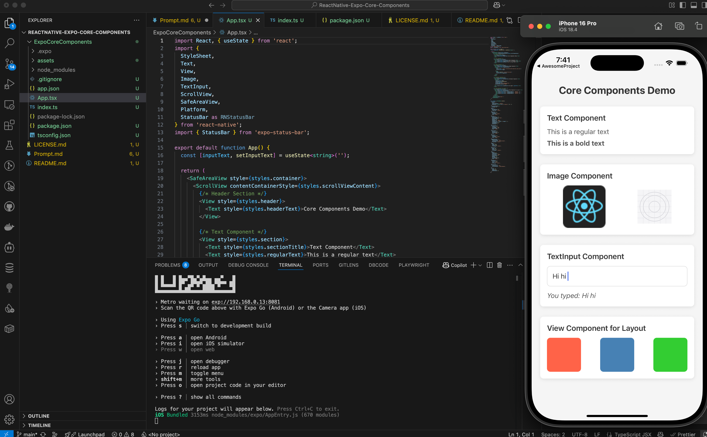

# React Native Core Components Demo

## Screenshot



A simple React Native app using Expo and TypeScript that demonstrates all the core components:

- **View**: Used throughout the app for layout and container purposes
- **Text**: Implemented with different styles (regular and bold)
- **Image**: Displaying both a network image (React Native logo) and a local image from the assets folder
- **TextInput**: Added with state management to capture and display user input
- **ScrollView**: Wrapping all content to make it scrollable
- **StyleSheet**: Used to organize and apply all styling in a structured way

The app has a clean, organized structure with separate sections for each component demonstration. It includes proper styling with shadows, border radius, and a pleasant color scheme. The StatusBar is properly implemented using Expo's StatusBar component.

## To run the app

To run your project, navigate to the directory and run one of the following npm commands.

```bash
cd ExpoCoreComponents
npm run android
npm run ios
```