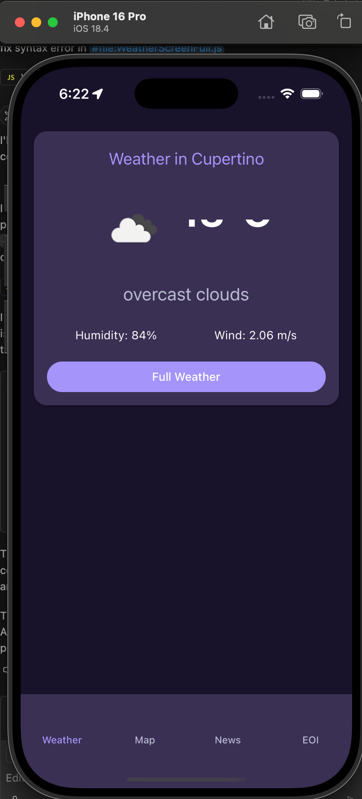
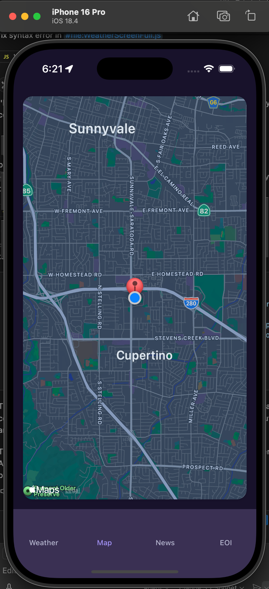
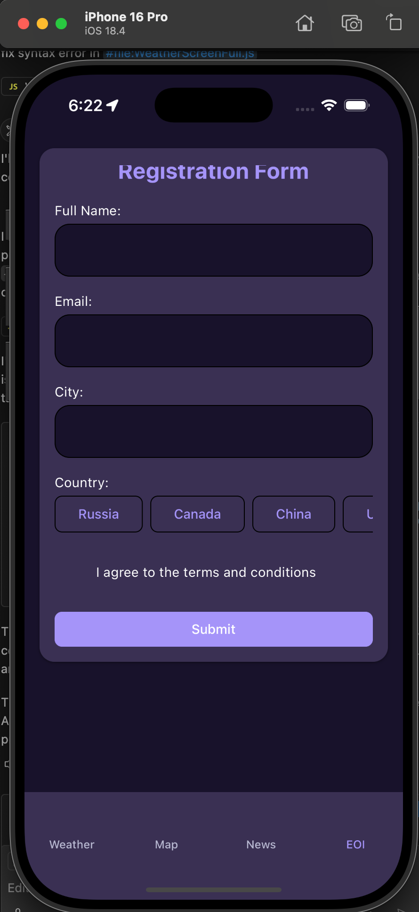
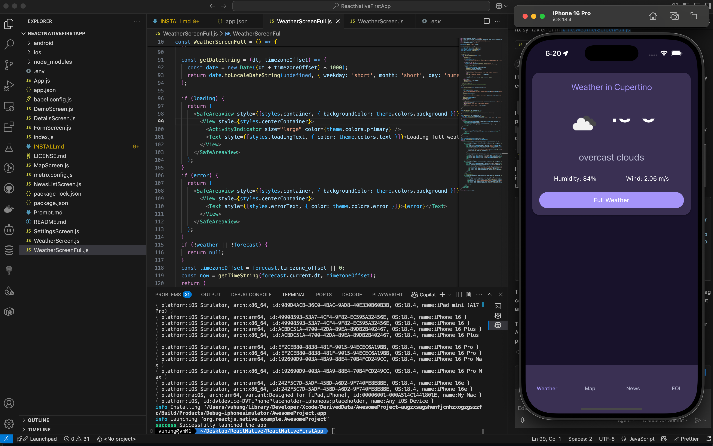

# React Native Core Components Demo

This project is a demo showcasing the use of React Native core components, along with real-world examples for weather, location, and news.

## Features
- Demonstrates usage of essential React Native components
- Real-world examples:
  - Weather information (OpenWeather API)
  - Location and maps (OpenStreetMap API)
  - News display

## React Native Components Used
- View
- Text
- Image
- TextInput
- Button
- TouchableOpacity
- ScrollView
- Pressable
- Modal
- ActivityIndicator
- Alert
- FlatList
- Switch

## Getting Started
See `INSTALLmd` for setup and running instructions.

---

This project is intended for learning and demonstration purposes.

# Screenshots

<table>
  <tr>
    <td></td>
    <td></td>
    <td></td>
    <td></td>
  </tr>
</table>

